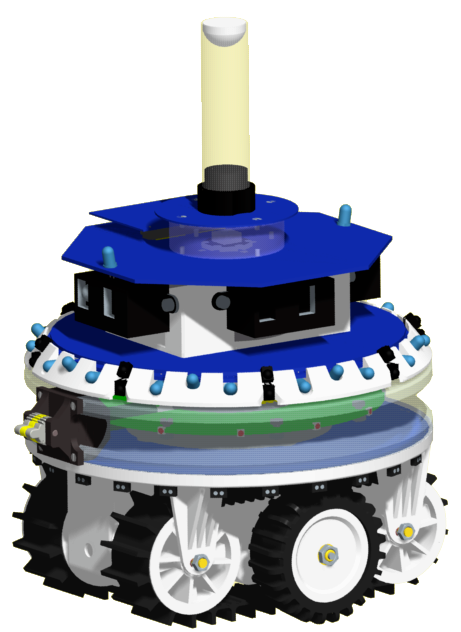

# Swarm robotics experiments in Argos Simulator using foot-bots

Welcome to the repository dedicated to experiments using the Argos Simulator and Footbot robots in the field of swarm robotics!

### Argos Simulator:
Argos is a powerful, modular, and flexible multi-robot simulator designed for swarm robotics research. Developed by the Institute for Systems and Robotics at the Instituto Superior Técnico in Lisbon, Portugal, Argos provides a realistic environment for simulating large-scale swarm behaviors and testing various algorithms and strategies. Its modular architecture allows researchers to easily extend and customize simulation scenarios to match specific experimental needs. Argos supports a wide range of robot platforms and sensor configurations, making it a popular choice for exploring complex swarm robotics phenomena.
For installation instructions on the Argos simulator: https://www.argos-sim.info/user_manual.php

### Footbot Robot:
The Footbot robot is a small, versatile, and highly maneuverable robot designed specifically for swarm robotics research. Developed as part of the Swarmanoid project, the Footbot features a compact and lightweight design, making it ideal for deployment in large numbers. Equipped with various sensors and actuators, including cameras, proximity sensors, and omni-directional wheels, the Footbot is capable of navigating diverse environments and interacting with its surroundings. Its modular architecture and open-source software framework enable researchers to experiment with different control algorithms and communication protocols, paving the way for advancements in swarm robotics technology.

  

In this repository, you will find the experimentation using Argos. Below is the detail for each case:

### Case 1 (Base Case):
- Food piles with different amounts of food have been randomly placed in the arena.
- One robot from a yellow base goes outward to search for food in the white area.
- After the robot collects the food, the food will be harvested and changes the color of the robot until the food is dropped.
- The food will be dropped in the yellow base and the color of the robot will change back.
The above steps will be repeated until all food is harvested.

### Case 2 (Ant Case):
- In this case, we have 2 types of robots, one will search for food in the arena and the other will search for food in a yellow base.
- One type of robot will search for food in the arena and drop it in the yellow circle and the other type will search and harvest food in the yellow circle and drop the food in the blue circle.
- Repeat the steps until all food is harvested in the blue circle.

### Case 3 (Bee Foraging Behaviour):
- This case has two parts, food scouting and harvesting.
- Two types of robots, scouts and harvester.
- The scout robot will scout the arena for food and store the number of food detected in the pile. The robot will change the color when the pile is detected.
- It will send the information to the nearest harvester and it will then harvest the food.
